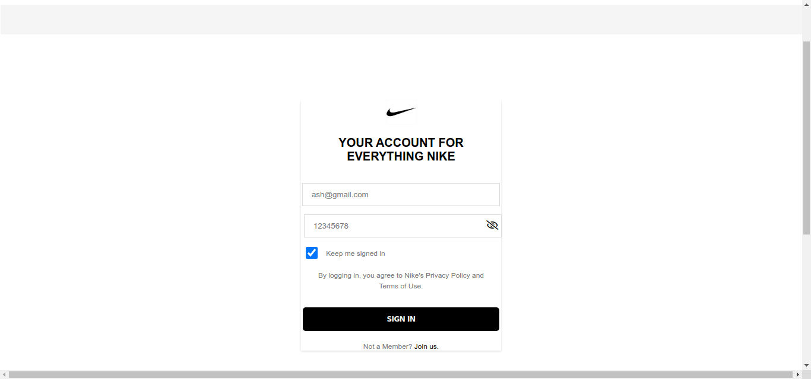
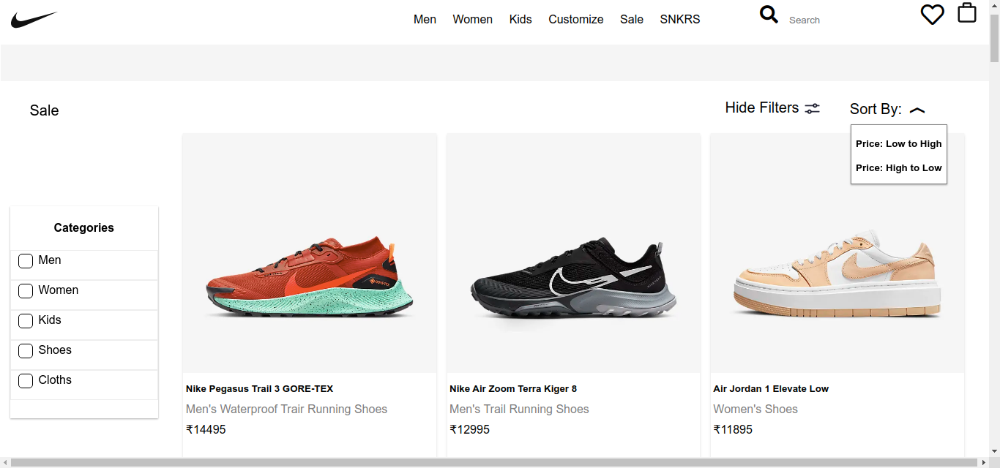

# Nike India Clone

### Hello everyone 👋, 
    
  In this project, we made a clone of nike India website where you can purchase sports wear of every category. Although we made clone of this site earlier [ https://github.com/Deepu2560/Nike ], Special about this is we used Backend technologies like Node.js, Express.js and MongoDB.
<hr/> 

 ## Features :-
<br/>

- ### Signup and Signin with validation and  Toggle Password



<br/>

- ### Sorting feature - Sort by price

- ### Filter features - Filter by category <kbd>Men women kids Cloths & Shoes</kbd>



<br/>
<hr/> 
<br/>

<h3 align="left">Languages and Tools:</h3>
<br/>
<p align="left"> 
 <a href="https://www.w3.org/html/" target="_blank" rel="noreferrer"> <!--HTML5 -->
 </a> 
 <a href="https://www.w3schools.com/css/" target="_blank" rel="noreferrer"> <!-- CSS -->
 </a> 
 <a href="https://developer.mozilla.org/en-US/docs/Web/JavaScript" target="_blank" rel="noreferrer"> <!-- JavaScript -->
 </a> 
 <a href="https://nodejs.org" target="_blank" rel="noreferrer"> <!-- NodeJS -->
 </a>
<a href="https://expressjs.com" target="_blank" rel="noreferrer"> <!-- EXPRESS -->
 </a>
<a href="https://www.mongodb.com/" target="_blank" rel="noreferrer"> <!-- MOngoDB -->
 </a> 
<a href="https://ejs.co/#install" target="_blank" rel="noreferrer"> <!-- EJS-->
 </a>  
<a href="https://heroku.com" target="_blank" rel="noreferrer"> <!-- HEROKU -->
 </a> 
 </p>
 <br/>
To make this Project, We used Frontend technologies <kbd> HTML CSS JAVASCRIPT</kbd>
and Backend Technologies<KBD>EJS</kbd>(Embedded JavaScript) <kbd>Node.Js Express.Js </kbd> and Database as <kbd>MongoDB</kbd>.

And also We deployed 🚀 this in <kbd>Heroku</kbd>. Check it once 😊

```bash
  https://nike-in-masai-project.herokuapp.com/
```
<br/>

## Team Members and Roles and Responsibility

<br>

- ### Ananda S Holla

  - [@Anands-88](https://github.com/Anands-88)

  - <p>Made Signup and SignIn page with both Frontend as well as Backend for validation Sales and Customize page and also Footer </p>

- ### Deepanshu Gulia

  - [@Deepu2560](https://github.com/Deepu2560)

  - <p>Made Womens 👩 Section all page, Payment Page. Also Took responsiblity of Merging all Code files to make one Website </p>

- ### Shubham Kumar
 
  - [@Shubhamfw13](https://github.com/Shubhamfw13)

  - <p> Made Sneakers 👟 all page and Cart page. Also did Backend works of all pages. Created APIs.   </p>
- ### Suraj Pathak
 
  - [@Dsurajpa123](https://github.com/surajpa123)

  - <p>Made Navbar, Mens 🧔  Section all pages and Wishlist page. </p>

- ### Faruk Khan

  - [@farukkhann](https://github.com/farukkhann)

  - <p> Kids 🧒 Sections all page and Checkout page</p>

<br/>

### Home Page


#### * Everyone contributed to make Home Page.
<br/>

## Thank You 🙏
